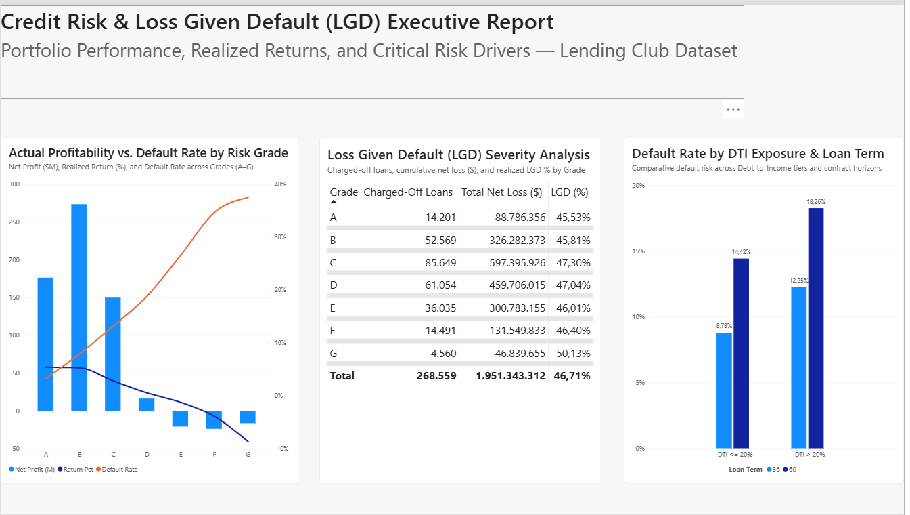

# Lending Club Credit Risk & Profitability Analytics

Executive credit risk analytics and portfolio performance project developed with **SQLite** (ETL, baseline aggregation, and portfolio risk validation) and **Power BI** (PBIP project format, Star Schema modeling, and TMDL DAX implementation).

The objective is to audit loan performance, quantify Loss Given Default (LGD), analyze realized net margins across risk grades, and evaluate exposure to critical debt drivers.

---

## Executive Report



---

## Business Questions & SQL Validation Process

Prior to building the semantic layer in Power BI, data integrity, cash-flow metrics, and portfolio distributions were audited in SQLite to answer three core executive questions:

### 1. Actual Profitability vs. Default Rate by Risk Grade
* **Business Intent**: Evaluate whether higher interest rates charged on riskier tiers (D–G) compensate for their default frequency, or if credit losses eliminate net returns.
* **SQL Query**:
```sql
SELECT
    b.grade,
    COUNT(f.loan_id) AS total_loans,
    ROUND(AVG(CASE WHEN s.loan_status = 'Charged Off' THEN 1.0 ELSE 0.0 END) * 100, 2) AS default_rate_pct,
    ROUND(SUM(f.total_pymnt) - SUM(f.funded_amnt), 2) AS net_profit,
    ROUND((SUM(f.total_pymnt) - SUM(f.funded_amnt)) / SUM(f.funded_amnt) * 100, 2) AS return_pct
FROM fact_loans f
JOIN dim_borrower b ON f.borrower_id = b.borrower_id
JOIN dim_loan_status s ON f.status_id = s.status_id
WHERE s.loan_status IN ('Fully Paid', 'Charged Off')
GROUP BY b.grade
ORDER BY b.grade;
```

---

### 2. Loss Given Default (LGD) Severity Analysis
* **Business Intent**: Quantify realized recovery performance and actual capital loss on defaulted debt across credit tiers.
* **SQL Query**:
```sql
SELECT
    b.grade,
    COUNT(f.loan_id) AS charged_off_loans,
    ROUND(SUM(f.funded_amnt - f.total_pymnt), 2) AS total_net_loss,
    ROUND(SUM(f.funded_amnt - f.total_pymnt) / SUM(f.funded_amnt) * 100, 2) AS lgd_pct
FROM fact_loans f
JOIN dim_borrower b ON f.borrower_id = b.borrower_id
JOIN dim_loan_status s ON f.status_id = s.status_id
WHERE s.loan_status = 'Charged Off'
GROUP BY b.grade
ORDER BY b.grade;
```

---

### 3. Default Concentration by DTI Exposure & Loan Term
* **Business Intent**: Identify high-risk borrower profiles by cross-referencing contractual duration (36 vs. 60 months) with debt-to-income burdens (DTI <= 20% vs. DTI > 20%).
* **SQL Query**:
```sql
SELECT
    c.term,
    CASE
        WHEN b.dti <= 20 THEN 'DTI <= 20%'
        ELSE 'DTI > 20%'
    END AS dti_exposure,
    COUNT(f.loan_id) AS total_loans,
    ROUND(AVG(CASE WHEN s.loan_status = 'Charged Off' THEN 1.0 ELSE 0.0 END) * 100, 2) AS default_rate_pct
FROM fact_loans f
JOIN dim_loan_contract c ON f.contract_id = c.contract_id
JOIN dim_borrower b ON f.borrower_id = b.borrower_id
JOIN dim_loan_status s ON f.status_id = s.status_id
WHERE s.loan_status IN ('Fully Paid', 'Charged Off')
GROUP BY c.term, dti_exposure
ORDER BY c.term, dti_exposure;
```

---

## Executive Findings

- **Margin Erosion in High-Risk Tiers**: While Grades A through C deliver positive net returns, realized profits turn negative starting at Grade E, with Default Rates approaching 40% in Grades F and G.
- **LGD Severity**: On 268,559 charged-off loans, total realized loss reached $1.95B with an overall LGD of 46.71% (peaking at 50.13% for Grade G).
- **Term & Debt Burden Compounding Risk**: Loans contracted for 60 months with DTI > 20% demonstrate an 18.26% default rate—more than double the 8.78% rate observed in 36-month contracts with low DTI.

---

## Technical Architecture & Modeling

- **Database**: SQLite database with schema separation across fact and normalized dimension tables.
- **Power BI Project (`.pbip`)**: Version-controlled tabular metadata using TMDL formatting.
- **Data Model**: Star Schema comprising `fact_loans` connected (1:* one-way relationships) to `dim_borrower`, `dim_loan_contract`, `dim_credit_bureau`, `dim_loan_status`, and `dim_date`.

---

## Core DAX & Business Logic

To reflect actual realized profitability and eliminate bias from ongoing credit, **open/current loans are explicitly isolated from terminal metrics**:

* **Net Profit**: Calculated exclusively on matured loans (`Fully Paid` vs. `Charged Off`).
* **Loss Given Default (LGD %)**: Cumulative net loss divided by the total funded amount of charged-off loans.
* **Return %**: Realized net profit expressed as a percentage of disbursed capital.

```dax
Net Profit =
CALCULATE(
    SUM(fact_loans[total_pymnt]) - SUM(fact_loans[funded_amnt]),
    dim_loan_status[loan_status_clean] IN {"Fully Paid", "Charged Off"}
)
```

---

## Repository Structure

```text
├── img/                                       # Dashboard captures and assets
├── lending_club_risk_analytics.Report/        # PBIP report layout and visual configurations
├── lending_club_risk_analytics.SemanticModel/ # Data model, TMDL tables & DAX definitions
│   └── definition/
│       ├── tables/
│       │   ├── _Medidas.tmdl                 # Centralized DAX logic
│       │   └── fact_loans.tmdl               # Fact table definitions
│       └── model.tmdl                        # Model relationships
├── .gitignore                                 # Excludes .db, .csv, and cache.abf binaries
└── lending_club_risk_analytics.pbip          # Power BI entrypoint
```

---

## How to Run Locally

1. Clone the repository:
   ```bash
   git clone [https://github.com/arypalacio-coder/lending-club-credit-risk-analytics.git](https://github.com/arypalacio-coder/lending-club-credit-risk-analytics.git)
   ```
2. Open `lending_club_risk_analytics.pbip` in **Power BI Desktop** (Developer Mode enabled).
3. Connect the semantic model to your SQLite database or processed source to refresh visuals.
